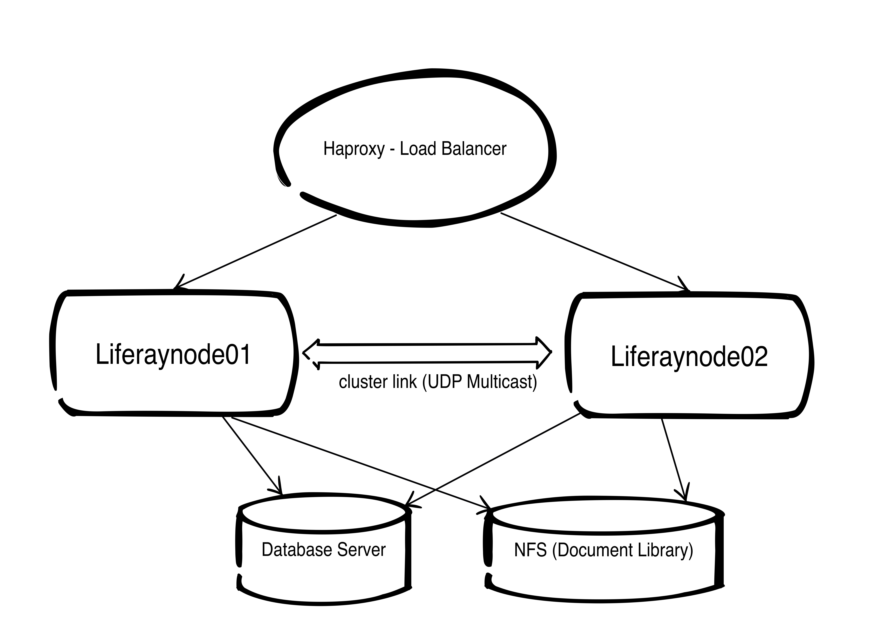
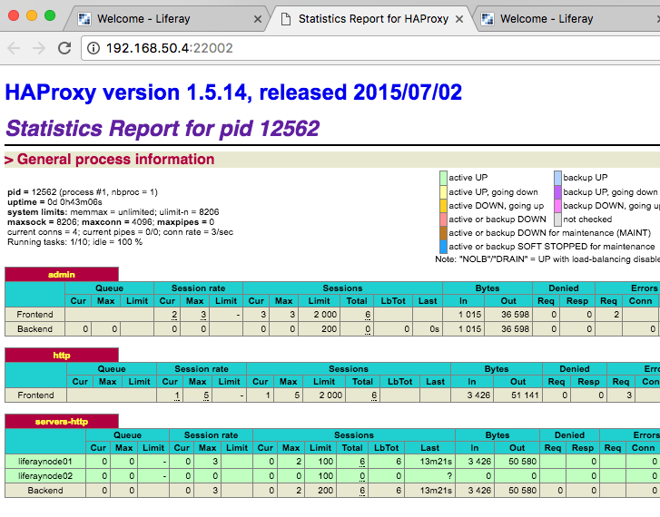

# Devops approach for build a Liferay Cluster - Demo by Sourcesense #

This repo is a Vagrant project for configure a Liferay Cluster in few minutes.

## Requirements ##

The following files are not stored in GIT. Please put it manually. If you change version of Liferay, remember to change the Chef attributes in order to reach the file correctly.

./sourcesense_liferay/files/default/liferay-portal-tomcat-6.2-ee-sp14-20151105114451508.zip
./sourcesense_liferay/files/default/activation-key-development-6.2ee-Sourcense.xml

VERY IMPORTANT THINGS:

- cluster.link.autodetect.address=192.168.50.4:3306 ( Vagrant configures by default a NAT interface. You cannot use it for cluster's messaging. This configuration force to use the internal network card)

- appsession JSESSIONID len 52 timeout 3h (HAPROXY CONFIGURATION - haproxy.cfg). Be sure to have this configuration in haproxy.cfg. This is mandatory for perform login passing through the loadbalancer

## Architecture ##

This  Vagrantfile container 3 nodes

- services01 => Mysql Server,NFS Server and Haproxy as reverse proxy (192.168.50.4)
- liferaynode01 => Liferay backend 1 (192.168.50.5)
- liferaynode02 => Liferay backend 2 (192.168.50.6)

### Network flow ###
[Http Client] => [ __services01__ (Haproxy Load Balancer) ]  ==>  [ __liferaynode01,liferaynode02__]

Check cluster status to in http://192.168.50.4

### Shared data between Liferay nodes ###
__liferaynode01__ ==> [shared data (nfs)] <== __liferaynode02__

### Database ###

[ liferaynode01,liferaynode02] ==> __services01__ (Mysql Server)

## Prepare you development environment ##
Install Vagrant, Virtualbox and ChefDK (https://downloads.chef.io/chef-dk/)

- launch 'vagrant plugin install vagrant-omnibus'
- launch 'vagrant plugin install vagrant-berkshelf'

## Provision the services server (services01) ##
This machine contains NFS Server, Mysqld and Haproxy.
- Go to folder 'vagrant-project' and launch "vagrant up services01"

## Provision the liferaynode01 ##
- Go to folder 'vagrant-project' and launch "vagrant up liferaynode01"

## Provision the liferaynode02 ##
- Go to 'vagrant-project' and launch "vagrant up liferaynode02"

### Contributions ###
+ Eugenio Marzo (eugenio.marzo@sourcesense.com)
+ Roberto Tacchi (roberto.tacchi@sourcesense.com)
+ Alessio Biancalana (alessio.biancalana@sourcesense.com)
